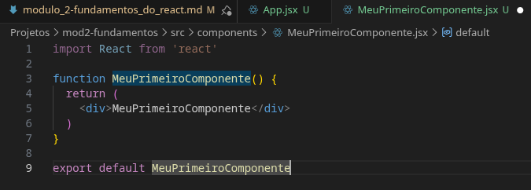
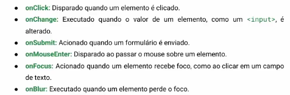

[MD RAIZ](anotacoes_modulo_1.md)

# Módulo 2 - Fundamentos do React

**Data de Inicio:** 

**Data de Término:** 

### Aulas:

- [06 - O que é JSX](https://youtu.be/PYARrSEw1z8)
- [07 - O que é um componente](https://youtu.be/-xwAGEreQS8)
- [08 - Comentários em JSX](https://youtu.be/wzt4WEFrac8)
- [09 - Template Expressions](https://youtu.be/heD7vJkB7mw)
- [10 - Eventos no Frontend](https://youtu.be/JmXiT7R3fHE)
- [11 - Funções de Renderização](https://youtu.be/okzi0PR2t5I)
- [12 - Imagens em React](https://youtu.be/z5K9AfmmqDg)
- [13 - Ciclo de Vida e Estados de um Componente](https://youtu.be/vzOZcinnbP8)
- [14 - Hooks e useState](https://youtu.be/5qN5GbHwmXU)
- [15 - Calculadora de Média (parte1)](https://youtu.be/Pa9xpsxkhjQ)
- [16 - Calculadora de Média (parte2)](https://youtu.be/7YK2EhBPvcw)
- [17 - Exercicio: Volume da Piscina](https://youtu.be/JYbYR_fiICQ)
- [18 - CSS Global em React](https://youtu.be/vM9IVNq4MPY)
- [19 - CSS Componente](https://youtu.be/gt7-8CXn3g4)
- [20 - CSS Inline](https://youtu.be/SiClNO6unPc)
- [21 - Classes Dinâmicas](https://youtu.be/OWazBXn6o4M)
- [22 - Renderização de Listas](https://youtu.be/g0QG0Q5XoXo)
- [23 - Previus State](https://youtu.be/KUqGToVTmX4)
- [24 - Renderização Condicional](https://youtu.be/0_N7CY6W7vo)
- [25 - Props em React](https://youtu.be/ug_NUodBXUU)
- [26 - Props Children](https://youtu.be/9fnbkMG46uk)
- [27 - Função como Props](https://youtu.be/ix3kvmMsjh8)
- [28 - Finalização do Módulo](https://youtu.be/OlyRYMLFf0M)

.
# Anotações:

## Aula 06 - O que é JSX:
    
Também conhecido como **JavaScript XML**, consiste em uma extensão para melhor produtividade e legibilidade, pois ela faz com que consiga ser integrado o **HTML** dentro do **código JS**, modularizando isto e facilitando a manutenção e a encontrar as funções. Também ele facilita com o que o dev consiga ter uma visualização da **interface de usuário (UI)**. 

> Deve se atentar que a **declaração de classes** no **HTML em JSX** é diferente, pois ``class`` é reservado tanto no **HTML** quanto no **JS**, por isso quando vai se referir a declaração de classes no HTML com o JSX, é usado ``className``, assim podendo ser acessado pelo **CSS**. ~ Professor Eduardo Gomes

> As **tags** em **HTML** são escritas toda em **minúsculas**; E para componentes personalizados do **JSX** é feito de forma capitalizada, ou seja, com a **Primeira Letra Maiuscúla.**. ~ Professor Eduardo Gomes

## Aula 07 - O que é um componente

Um dos conceitos centrais do React, ele faz a **componentização**, ou seja, decompor a interface do usuário em vários elementos.

### Prática:

Com o uso da extensão instalada nas aulas anteriores (Módulo 1), pode ser usado o código ``rfce`` para a criação da base de um componente:



## Aula 08 - Componentes em JSX

Para comentar em JSX, não se faz apenas o uso do // ou /**/, para isso, deve ser aberto o JS dentro do código com as chaves ``{}``, ficando dessa forma:
``` JSX
{/*Primeiro componente criado no curso*/}
```

## Aula 09 - Template Expressions

O conceito **Template Expression** é o que fazemos com as chaves, ``{}``, ou seja, incorporar um código **JS**, 

## Aula 10 - Eventos no Front End

Os eventos são usados para **capturar interações do usuário** e **responder elas de forma dinâmica**, são nomeados da forma **camelCase**, ou seja a **primeira letra** minúscula e a seguir a primeira é maiuscula, exemplo: ``onChange``, ``onStart``, **...**.


###### Fonte: Aula 10 - Eventos no Front End (1:55)

## Aula 11 - Funções de Renderização

