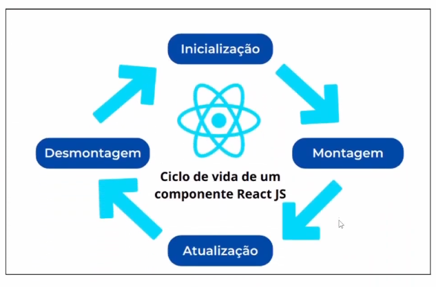
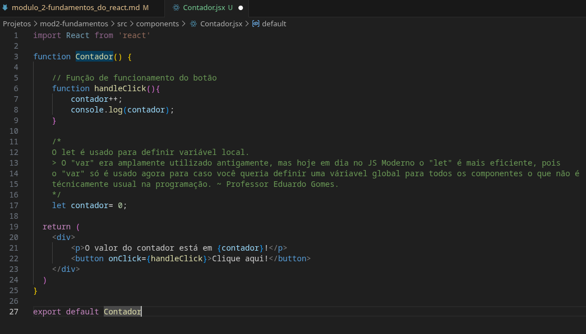
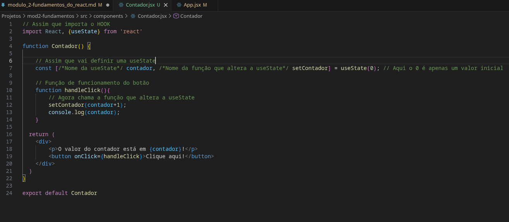

# Módulo 2 - Fundamentos do React

[MD RAIZ](anotacoes_modulo_1.md)

**Data de Inicio:** 27/12/2025

**Data de Término:**

## Aulas

- [06 - O que é JSX](https://youtu.be/PYARrSEw1z8)
- [07 - O que é um componente](https://youtu.be/-xwAGEreQS8)
- [08 - Comentários em JSX](https://youtu.be/wzt4WEFrac8)
- [09 - Template Expressions](https://youtu.be/heD7vJkB7mw)
- [10 - Eventos no Frontend](https://youtu.be/JmXiT7R3fHE)
- [11 - Funções de Renderização](https://youtu.be/okzi0PR2t5I)
- [12 - Imagens em React](https://youtu.be/z5K9AfmmqDg)
- [13 - Ciclo de Vida e Estados de um Componente](https://youtu.be/vzOZcinnbP8)
- [14 - Hooks e useState](https://youtu.be/5qN5GbHwmXU)
- [15 - Calculadora de Média (parte1)](https://youtu.be/Pa9xpsxkhjQ)
- [16 - Calculadora de Média (parte2)](https://youtu.be/7YK2EhBPvcw)
- [17 - Exercicio: Volume da Piscina](https://youtu.be/JYbYR_fiICQ)
- [18 - CSS Global em React](https://youtu.be/vM9IVNq4MPY)
- [19 - CSS Componente](https://youtu.be/gt7-8CXn3g4)
- [20 - CSS Inline](https://youtu.be/SiClNO6unPc)
- [21 - Classes Dinâmicas](https://youtu.be/OWazBXn6o4M)
- [22 - Renderização de Listas](https://youtu.be/g0QG0Q5XoXo)
- [23 - Previus State](https://youtu.be/KUqGToVTmX4)
- [24 - Renderização Condicional](https://youtu.be/0_N7CY6W7vo)
- [25 - Props em React](https://youtu.be/ug_NUodBXUU)
- [26 - Props Children](https://youtu.be/9fnbkMG46uk)
- [27 - Função como Props](https://youtu.be/ix3kvmMsjh8)
- [28 - Finalização do Módulo](https://youtu.be/OlyRYMLFf0M)

.

## Anotações

### Aula 06 - O que é JSX

Também conhecido como **JavaScript XML**, consiste em uma extensão para melhor produtividade e legibilidade, pois ela faz com que consiga ser integrado o **HTML** dentro do **código JS**, modularizando isto e facilitando a manutenção e a encontrar as funções. Também ele facilita com o que o dev consiga ter uma visualização da **interface de usuário (UI)**.

> Deve se atentar que a **declaração de classes** no **HTML em JSX** é diferente, pois ``class`` é reservado tanto no **HTML** quanto no **JS**, por isso quando vai se referir a declaração de classes no HTML com o JSX, é usado ``className``, assim podendo ser acessado pelo **CSS**.
As **tags** em **HTML** são escritas toda em **minúsculas**; E para componentes personalizados do **JSX** é feito de forma capitalizada, ou seja, com a **Primeira Letra Maiuscúla.**. ~ Professor Eduardo Gomes

### Aula 07 - O que é um componente

Um dos conceitos centrais do React, ele faz a **componentização**, ou seja, decompor a interface do usuário em vários elementos.

#### 7.1 Prática

Com o uso da extensão instalada nas aulas anteriores (Módulo 1), pode ser usado o código ``rfce`` para a criação da base de um componente:


### Aula 08 - Componentes em JSX

Para comentar em JSX, não se faz apenas o uso do // ou /**/, para isso, deve ser aberto o JS dentro do código com as chaves ``{}``, ficando dessa forma:

``` JSX
{/*Primeiro componente criado no curso*/}
```

### Aula 09 - Template Expressions

O conceito **Template Expression** é o que fazemos com as chaves, ``{}``, ou seja, incorporar um código **JS**,

### Aula 10 - Eventos no Front End

Os eventos são usados para **capturar interações do usuário** e **responder elas de forma dinâmica**, são nomeados da forma **camelCase**, ou seja a **primeira letra** minúscula e a seguir a primeira é maiuscula, exemplo: ``onChange``, ``onStart``, **...**.


**Fonte: Aula 10 - Eventos no Front End (1:55)**

### Aula 11 - Funções de Renderização

As coisas não precisam ser renderizadas apenas de forma direta dentro do ``return``, eles podem ser colocados no **JS**, e passados para renderizar na parte **HTML**.

### Aula 12 - Imagens no React

As imagens são um elemento muito importante na composição da UI e são amplamente utilizadas, que para sua implementação vária do modo e forma que vai ser usada o que ocasiona no lugar onde vai estar insirida no projeto.

> As imagens de forma mais técnica são chamadas de **Ativos** ~ Professor Eduardo Gomes

Você pode colocar as imagens na pasta ``public``, que está destinado para **Ativos** fixos, ou seja, aqueles que não vão ter alteração.
Além da pasta ``public``, você pode colocar o **Ativo** na pasta *source*, ``src``, em que está destinado os scripts, componentes, **...**, coloca-se o ativo na pasta ``src``quando vai ter alterações nele, por exemplo, um jogo em que vai ser trocada e alterada as propriedades da imagem durante a execução de forma dinâmica.

Dentro da pasta ``src``, se for um ativo que vai ser utilizado em mais componentes coloca-se na pasta ``assets``, porém se for estar ligada diretamente a um componente, pode ser criado uma pasta para o componente contendo os ativos ligados diretamente a ele.

### Aula 13 - Ciclo de Vida e Estados de um Componente

Seria as **etapas** que um **componente** passa desde sua criação até sua remoção na página. Incluindo principalmente as **fases de inicialização, montagem, atualização e desmontagem**.



**Estado** seria a propriedade do componente, em que pode ser alterado ao longo das etapas. Na **inicialização**, é passado as propriedades iniciais, ou seja, o estado inicial, na **montagem** ele é formado para a apresentação na aplicação de acordo com o que foi passado na inicialização, a **atualização** é quando está aparecendo e se houver uma atualização nas suas propriedades o estado vai ser alterado, na **desmontagem** é quando o estado muda para a retirada dele na aplicação. Isso é **quase o mesmo processo** que há de ciclo de vida em uma **aplicação** também.

### Aula 14 - Hooks e useState

O **Hook** de forma bem resumida são **funções** que **facilitam o uso de recursos avançados** de componentes funcionais no React.
Permitindo **armazenar informações**, **chamadas de estado** e **executar ações** em momentos específicos do ciclo de vida do componente.

**Exemplo:** Quando você vai criar o **botão que aumenta o contador**, a **váriavel muda**, mas o **parágrafo** responsável por mostrar o valor atual **não é re-renderizado**, necessitando de recarregar a págian (**F5**), por isso ele necessíta de um **Hook** que faça ele ser re-renderizado.

#### 14.1 Prática



O que vai ser necessário usar é o **Hook**, ``useState``, ele é o mais utilizado no React, pois serve para armazenar um **estado**.
Por que utlizaremos esse **Hook** invés de armazenar em uma váriavel? Porquê ele dessa forma vai armazenar e **toda vez que alterar**, apenas
alterar o elemento que use aquele **estado**.



Caso você vai usar uma váriavel que **altera apenas dentro da função** e **não vai usa-la depois**, pode ser declarada da **forma tradicional**, ``let``, mas
se for **vincular ela a um elemento da página** deve ser utilizado um **Hook**, principalmente, ``useState``.

Ou seja:

**Não precisa** renderizar **->** ``let``
**Precisa** renderizar **->** ``useState``
